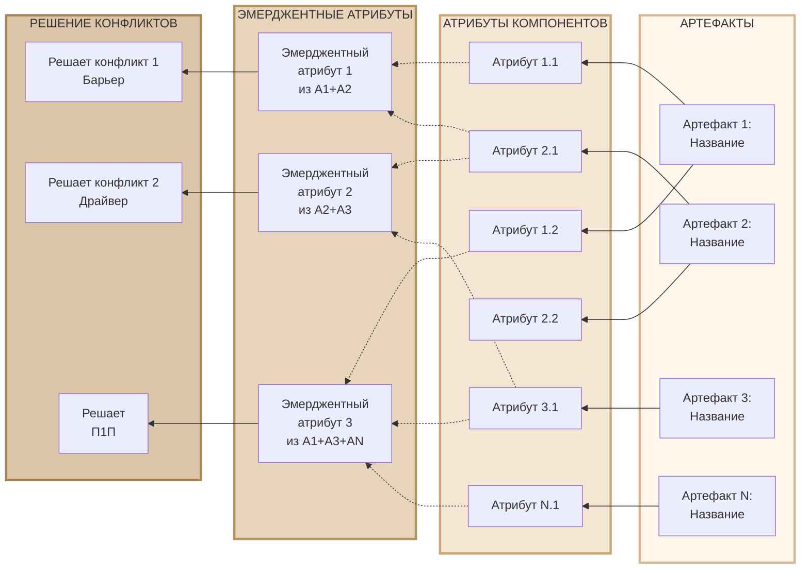
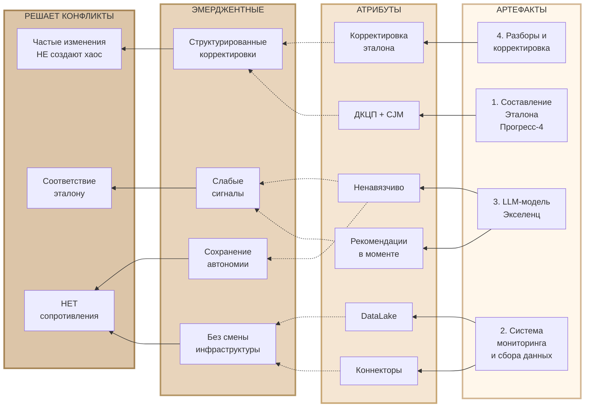

# Шаблон диаграммы артефактов и атрибутов ДКЦП

## Назначение

Этот шаблон предназначен для графического представления артефактов (раздел 3) и атрибутов (раздел 4) ДКЦП-модели с использованием Mermaid-диаграмм.

Диаграмма визуализирует:
- **Артефакты** — компоненты решения
- **Прямые атрибуты** — свойства отдельных артефактов
- **Эмерджентные атрибуты** — свойства, возникающие из взаимодействия нескольких артефактов
- **Решение конфликтов** — связь прямых или эмерджентных атрибутов с разрешением конфликта из раздела 2

---

## Структура диаграммы

Диаграмма читается **справа налево** в 4 столбца:

```
АРТЕФАКТЫ → АТРИБУТЫ КОМПОНЕНТОВ -.-> ЭМЕРДЖЕНТНЫЕ АТРИБУТЫ → РЕШЕНИЕ КОНФЛИКТОВ
```

### Типы связей

- **Сплошная линия** (→) — прямое владение: артефакт имеет атрибут
- **Пунктирная линия** (-.→) — эмерджентность: атрибуты порождают новое свойство

### Цветовая схема

Используется бежевая палитра на основе фирменного цвета #FFF7EB:

- **Артефакты**: #FFF7EB (самый светлый)
- **Атрибуты**: #F5E6D3
- **Эмерджентные**: #E8D4BB
- **Конфликты**: #DCC5A8 (самый темный)

---

## Универсальный шаблон



---

## Инструкция по применению

### Шаг 1: Подготовка данных из ДКЦП-модели

Из вашей готовой ДКЦП-модели возьмите:

1. **Раздел 2**: Формулировки Барьера, Драйвера, П1П
2. **Раздел 3**: Список артефактов (компонентов решения)
3. **Раздел 4**: 
   - Атрибуты компонентов (прямые свойства каждого артефакта)
   - Эмерджентные атрибуты (свойства системы в целом)

### Шаг 2: Заполнение столбца "АРТЕФАКТЫ"

Перенесите артефакты из раздела 3 в том порядке, в котором они перечислены:

```mermaid
A1["Артефакт 1:<br/>Название из раздела 3"]
A2["Артефакт 2:<br/>Название из раздела 3"]
```

**Пример из Эталона-М:**
```mermaid
A1["1. Составление Эталона<br/>маркетинга<br/>Прогресс-4"]
A2["2. Система мониторинга<br/>и сбора данных"]
```

### Шаг 3: Заполнение столбца "АТРИБУТЫ КОМПОНЕНТОВ"

Для каждого артефакта перенесите его атрибуты из раздела 4.1:

```mermaid
AT1["Атрибут артефакта 1"]
AT2["Другой атрибут артефакта 1"]
AT3["Атрибут артефакта 2"]
```

Соедините их с артефактами:
```mermaid
A1 --> AT1
A1 --> AT2
A2 --> AT3
```

**Пример из Эталона-М:**
```mermaid
AT1["Эталон формируется через<br/>диагностическую сессию<br/>и исследование"]
AT2["Включает ценностное<br/>предложение ДКЦП<br/>и карту пути клиента CJM"]

A1 --> AT1
A1 --> AT2
```

### Шаг 4: Заполнение столбца "ЭМЕРДЖЕНТНЫЕ АТРИБУТЫ"

Перенесите эмерджентные атрибуты из раздела 4.2. 

**Важно**: указывайте в скобках, из каких артефактов возникает свойство:

```mermaid
E1["Эмерджентный атрибут<br/>из А1+А2"]
```

Соедините пунктирными линиями с теми прямыми атрибутами, которые его порождают:

```mermaid
AT1 -.-> E1
AT3 -.-> E1
```

**Пример из Эталона-М:**
```mermaid
E1["Структурированные<br/>частые корректировки"]

AT1 -.-> E1
AT16 -.-> E1
AT17 -.-> E1
```

### Шаг 5: Заполнение столбца "РЕШЕНИЕ КОНФЛИКТОВ"

Перенесите формулировки из раздела 2 (обычно 3 основных конфликта):

- Барьер
- Драйвер  
- П1П

Укажите, какие атрибуты решают каждый конфликт. Это могут быть:
- **Эмерджентные атрибуты** (чаще всего)
- **Прямые атрибуты** (когда свойство одного артефакта напрямую решает конфликт)

```mermaid
E1 --> D1
E2 --> D1
AT5 --> D3  # прямой атрибут тоже может решать конфликт
```

**Пример из Эталона-М:**
```mermaid
D1["Частые изменения<br/>НЕ создают хаос"]

E1 --> D1
E2 --> D1
E3 --> D1
```

### Шаг 6: Проверка множественных связей

Убедитесь, что:

1. ✅ Один артефакт может иметь несколько атрибутов
2. ✅ Один эмерджентный атрибут может возникать из атрибутов разных артефактов
3. ✅ Один конфликт может решаться несколькими атрибутами (как эмерджентными, так и прямыми)
4. ✅ Один атрибут (прямой или эмерджентный) может решать несколько конфликтов

Используйте синтаксис `&` для множественных связей:
```mermaid
AT1 & AT3 & AT5 -.-> E1
E1 & E2 & AT10 --> D1
```

---

## Примеры использования

### Пример 1: Упрощенная версия (для презентаций)

Если полная диаграмма слишком громоздкая, создайте упрощенную версию с ключевыми элементами:



### Пример 2: Полная версия Эталона-М

См. файл: [[Эталон-М ДКЦП-модель#Диаграмма артефактов и атрибутов]]

---

## Рекомендации

### Когда использовать

- ✅ При презентации ДКЦП клиенту для визуализации связи артефактов и решения конфликта
- ✅ При внутренней работе над моделью для проверки логики решения
- ✅ При документировании проекта

### Советы по оформлению

1. **Сокращайте текст**: используйте переносы строк (`<br/>`) для длинных формулировок
2. **Группируйте логически**: атрибуты одного артефакта располагайте рядом
3. **Выделяйте ключевое**: самые важные эмерджентные свойства можно делать жирнее или выносить в упрощенную версию
4. **Проверяйте читаемость**: если диаграмма становится слишком сложной, разбейте на несколько или создайте упрощенную версию

### Частые ошибки

❌ **Неправильно**: Использовать сплошную линию для эмерджентных свойств
```mermaid
AT1 --> E1  # Неправильно
```

✅ **Правильно**: Использовать пунктирную линию
```mermaid
AT1 -.-> E1  # Правильно
```

❌ **Неправильно**: Не указывать источники эмерджентного свойства
```mermaid
E1["Структурированные корректировки"]
```

✅ **Правильно**: Указывать источники в скобках или через связи
```mermaid
E1["Структурированные корректировки<br/>из А1+А4"]
```

---

## Связь с другими компонентами ДКЦП

Эта диаграмма дополняет:

- **Диаграмму конфликта** (раздел 2) — показывает, КАК артефакты и их атрибуты решают конфликт
- **Текстовое описание артефактов** (раздел 3) — визуализирует структуру
- **Текстовое описание атрибутов** (раздел 4) — показывает связи между прямыми и эмерджентными атрибутами, а также их вклад в решение конфликта

---

## Версионность

**Версия**: 1.0  
**Дата создания**: 2025-12-09  
**Основано на**: ДКЦП-модель Эталона-М
