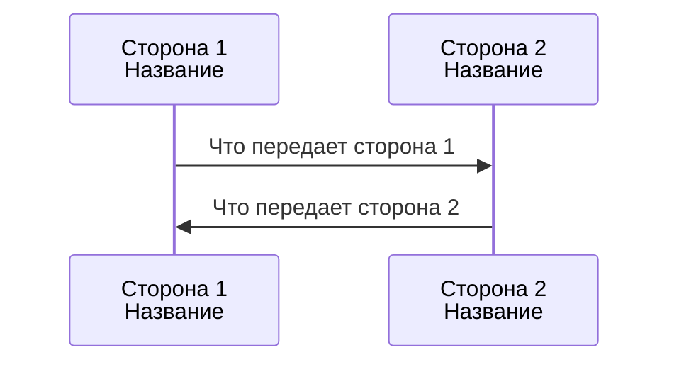
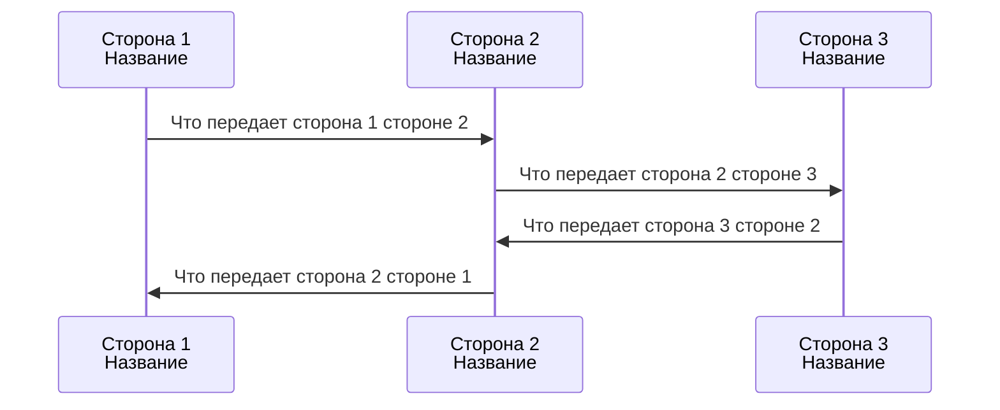
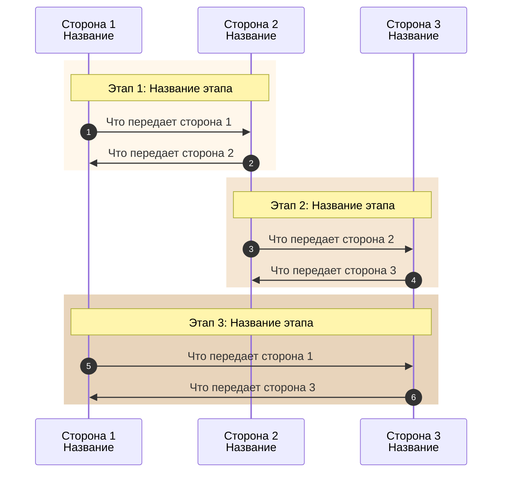
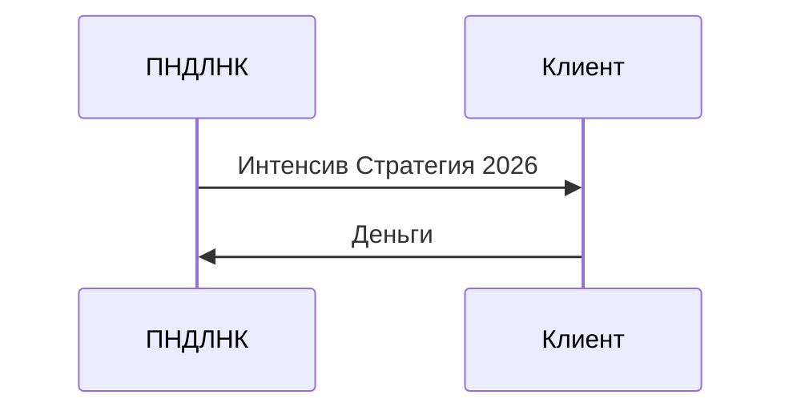
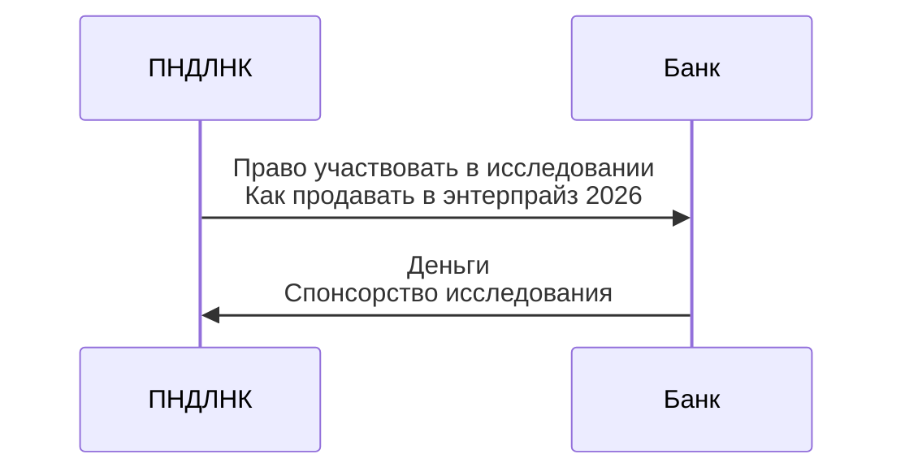
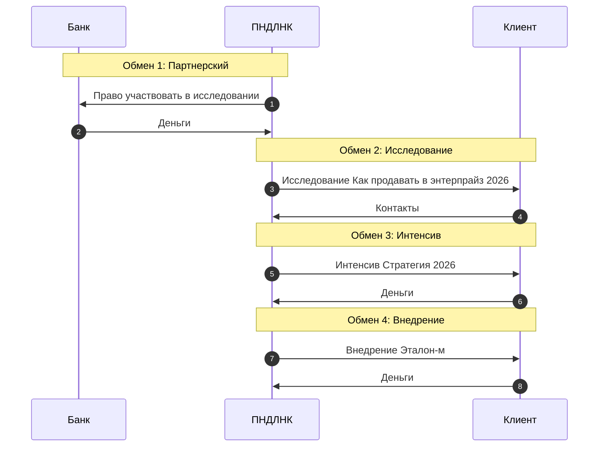

# Шаблон диаграммы обмена: Sequence Diagram

## Назначение

Sequence Diagram (диаграмма последовательности) используется для визуализации обменов между акторами в модели ДКЦП. Диаграмма показывает:
- Участников обмена (стороны)
- Что обменивает каждая сторона с другой

## Базовый шаблон: Простой обмен (2 актора)

### Инструкция по заполнению

1. **Участники (participant)**:
   - Замените "Сторона 1" и "Сторона 2" на названия участников обмена
   - Укажите их роль или характеристики (опционально)

2. **Сообщения (стрелки)**:
   - Укажите, что передает каждая сторона другой
   - Это может быть артефакт, деньги, контакты, услуга и т.д.

---

## Шаблон 2: Сложный обмен (3+ актора)

### Инструкция по заполнению

1. Добавьте всех участников обмена как `participant`
2. Покажите последовательность обменов между сторонами
3. Укажите, что передает каждая сторона другой

---

## Шаблон 3: Воронка продаж (система обменов)

### Инструкция по заполнению

1. Используйте `autonumber` для автоматической нумерации шагов
2. Разделите воронку на этапы с помощью `rect` (прямоугольники)
3. Для каждого этапа укажите участников и что они обменивают
4. Используйте `Note` для названия этапа (опционально)

### Цветовая схема для этапов

- Этап 1: `rgb(255, 247, 235)` - #FFF7EB
- Этап 2: `rgb(245, 230, 211)` - #F5E6D3
- Этап 3: `rgb(232, 212, 187)` - #E8D4BB
- Этап 4: `rgb(220, 197, 168)` - #DCC5A8

---

## Примеры заполнения

### Пример 1: Простой обмен (ПНДЛНК ↔ Клиент)

### Пример 2: Партнерский обмен (ПНДЛНК ↔ Банк)

### Пример 3: Все обмены в системе (ПНДЛНК, Банк, Клиент)

---

## Правила оформления

### 1. Участники (participant)

- Используйте понятные названия сторон
- Для длинных названий используйте алиасы: `participant ПНДЛНК as ПНДЛНК`
- Можно добавить краткое описание через ` `

### 2. Сообщения (стрелки)

- Используйте `->>` для синхронных сообщений
- Указывайте кратко, что передается
- Можно использовать ` ` для переноса строки в длинных описаниях

### 3. Воронки продаж

- Используйте `autonumber` для нумерации шагов
- Разделяйте этапы с помощью `rect` с цветовой схемой
- Используйте `Note` для названия этапа (опционально)

### 4. Несколько обменов

- Используйте `Note` для разделения разных обменов (опционально)
- Показывайте последовательность обменов во времени

## Связь с блоками ДКЦП

Диаграмма обмена показывает:
- **Участники** → могут соответствовать блокам 1 (Клиентский сегмент) и 7 (Атрибуты компании)
- **Что передает сторона 1** → может быть артефактом (блок 3) или вкладом клиента (блок 5)
- **Что передает сторона 2** → может быть артефактом (блок 3) или вкладом клиента (блок 5)

Детальная информация о мотивационных конфликтах, аргументах, условиях обмена и ценности хранится в полной ДКЦП-модели.

## Версионность

**Версия**: 1.0  
**Дата создания**: 2025-01-XX  
**Формат**: Sequence Diagram (Mermaid)  
**Принцип**: Минималистичность - только участники и предметы обмена
