# Шаблон диаграммы "грозовой тучи" (Мотивационный конфликт)

## Упрощенная версия (только основные связи)

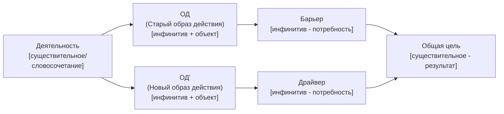

## Вариант с вертикальным выравниванием через подграфы

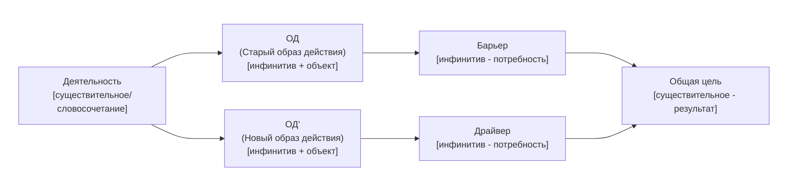

## Полная версия с допущениями и противоречиями (базовый вариант)

### Разделение на две диаграммы

**Основная структура:**

**Допущение барьера:**
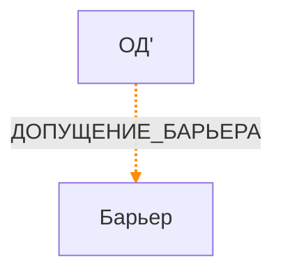

**Допущение драйвера:**
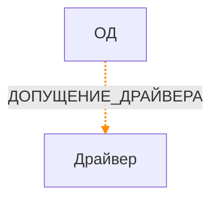

**Противоречие первого порядка (П1П):**
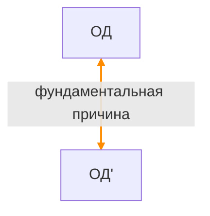

**Противоречие второго порядка (П2П) - опционально:**
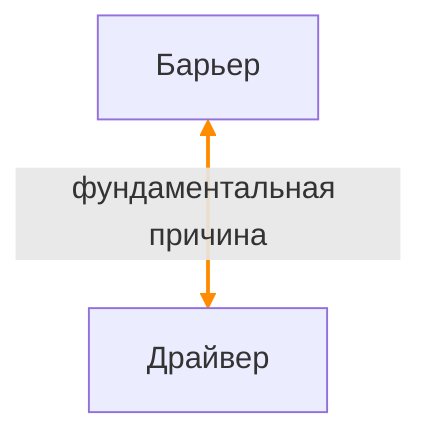

**Шаблон для текстовых описаний:**
- **Допущение барьера:** Если я [ОД'], это угрожает моей потребности [БАРЬЕР], потому что [ДОПУЩЕНИЕ_БАРЬЕРА]
- **Допущение Драйвера:** Если я [ОД], это угрожает потребности [ДРАЙВЕР], потому что [ДОПУЩЕНИЕ_ДРАЙВЕРА]
- **Противоречие первого порядка (П1П):** [ОД] и [ОД'] несовместимы, потому что [фундаментальная причина]
- **Противоречие второго порядка (П2П):** [Барьер] и [Драйвер] несовместимы, потому что [фундаментальная причина]

## Инструкция по использованию

1. **Заполните плейсхолдеры** в квадратных скобках значениями из вашего мотивационного конфликта
2. **Выберите вариант диаграммы:**
   - **Упрощенная версия** - только основные связи, лучше для выравнивания блоков (рекомендуется для основной визуализации)
   - **Вариант с подграфами** - гарантирует вертикальное расположение ОД/ОД' и Барьер/Драйвер
   - **Полная версия (базовый)** - разделение на две диаграммы: основная структура и допущения/противоречия отдельно (лучшая читаемость)
3. **Проверьте расположение блоков:**
   - ОД и ОД' должны быть друг над другом
   - Барьер и Драйвер должны быть друг над другом
4. **Разница между диаграммами и текстовыми описаниями:**
   - **В диаграммах допущений:** указывайте только само допущение без вспомогательных конструкций ("ДОПУЩЕНИЕ_БАРЬЕРА"), так как связь между элементами видна визуально
   - **В диаграммах противоречий (П1П, П2П):** указывайте только причину противоречия (часть после "потому что"), так как связь между элементами и факт их несовместимости видны визуально
   - **В текстовых описаниях:** используйте полные формулировки с вспомогательными конструкциями ("Если я ОД', это угрожает моей потребности Барьер, потому что ДОПУЩЕНИЕ_БАРЬЕРА" или "[ОД] и [ОД'] несовместимы, потому что [причина]")
5. **Рекомендация:** 
   - Для основной визуализации используйте упрощенную версию
   - Для показа допущений и противоречий используйте базовый вариант (разделение на отдельные диаграммы)

## Пример заполнения (упрощенная версия)

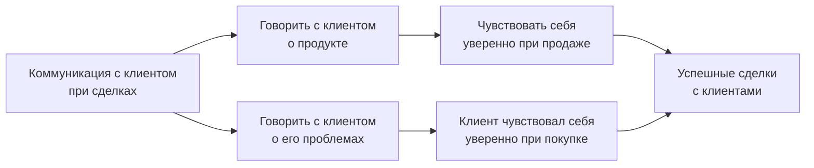

## Пример заполнения (с вертикальным выравниванием)

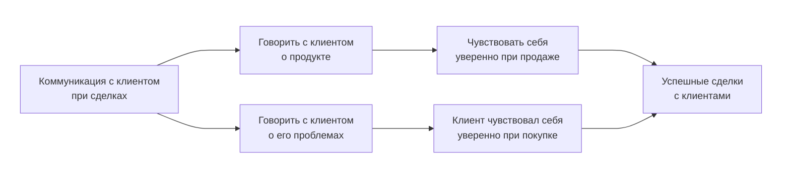

## Примеры заполнения для полной версии

### Пример: Базовый вариант (разделение на две диаграммы)

**Основная структура:**

**Допущение барьера:**
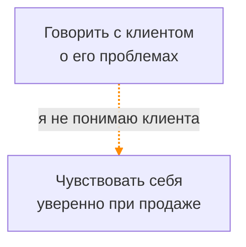

**Допущение драйвера:**
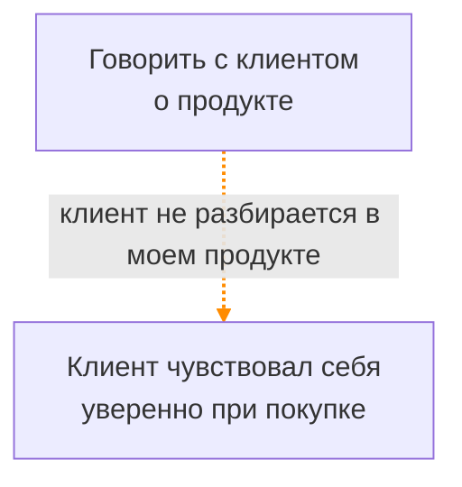

**Противоречие первого порядка (П1П):**
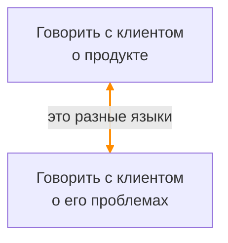

**Противоречие второго порядка (П2П) - опционально:**
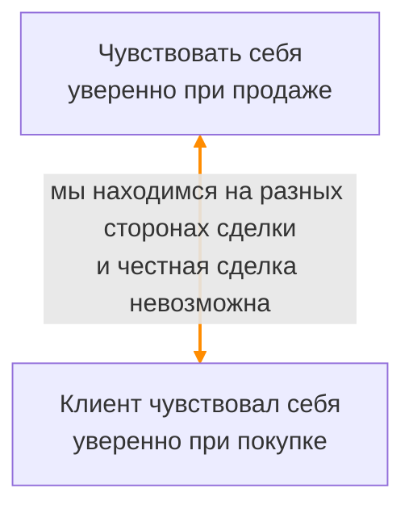

## Текстовые описания противоречий

**Важно:** 
- В диаграммах допущений показывается только само допущение без вспомогательных конструкций (например, "ДОПУЩЕНИЕ_БАРЬЕРА"), так как связь между элементами видна визуально
- В диаграммах противоречий (П1П, П2П) показывается только причина противоречия (часть после "потому что"), так как связь между элементами и факт их несовместимости видны визуально
- В текстовых описаниях используются полные формулировки с вспомогательными конструкциями ("Если я...", "это угрожает...", "[элементы] несовместимы, потому что...") для полного понимания контекста

**Примеры текстовых описаний:**
- **Противоречие первого порядка (П1П):** "Говорить с клиентом о продукте" и "Говорить с клиентом о его проблемах" несовместимы, потому что это разные языки
- **Допущение барьера:** Если я говорю с клиентом о его проблемах, это угрожает моей потребности чувствовать себя уверенно при продаже, потому что я не понимаю клиента
- **Допущение Драйвера:** Если я говорю с клиентом о продукте, это угрожает потребности клиента чувствовать себя уверенно при покупке, потому что клиент не разбирается в моем продукте
- **Противоречие второго порядка (П2П):** Добиться того, чтобы клиент чувствовал себя уверенно в сделке и продавец чувствовал себя уверенно в сделке невозможно, потому что мы находимся на разных сторонах сделки и честная сделка невозможна

## Примечания

- **Упрощенная версия** (без допущений и противоречий) обеспечивает лучшее выравнивание блоков
- **Базовый вариант (разделение)** - наиболее читаемый способ показать допущения и противоречия
- В mermaid flowchart точное позиционирование блоков может варьироваться в зависимости от рендерера
- Для гарантированного вертикального выравнивания используйте вариант с подграфами (subgraph)
- Оранжевые стрелки (допущения) отображаются пунктирными линиями с оранжевым цветом
- Двойные стрелки (противоречия) показывают взаимосвязь между блоками

